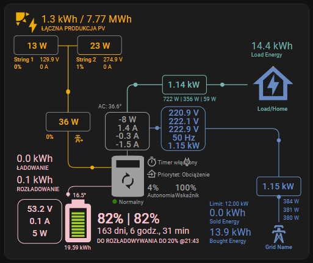
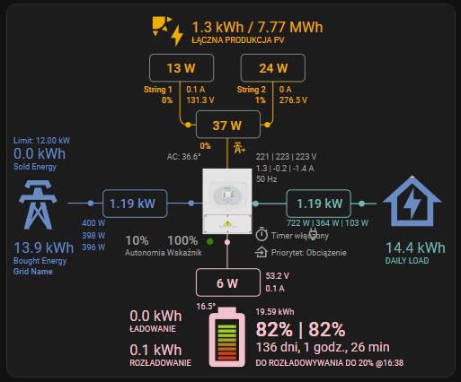
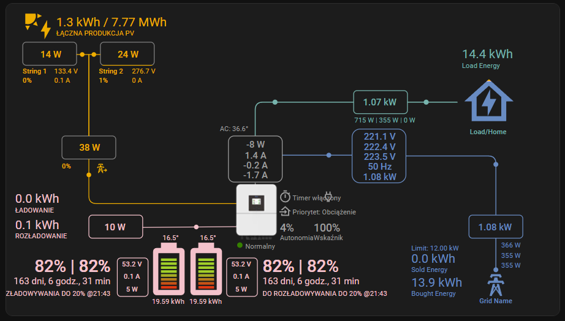

# Sunsynk Power Flow Card Configuration Examples

This document provides configuration examples for the **Sunsynk Power Flow Card**, tailored for the Deye Inverter setup in this project.

## Prerequisites

To use these configurations, you must have the **Sunsynk Power Flow Card** installed in your Home Assistant instance.

- **Project Link**: [Sunsynk Power Flow Card on GitHub](https://github.com/slipx06/sunsynk-power-flow-card)
- **Installation**: It is recommended to install this card via **HACS** (Home Assistant Community Store). Search for `sunsynk-power-flow-card` in the frontend section.

## Configuration Examples

> **Note:** These examples are currently ready to use only for **3-phase inverters**. For **1-phase inverters**, you must adapt the configuration to use the entities available in the single-phase Deye integration.

Below are three different dashboard card configurations. Each example serves a different visual preference.

### Example 1: Full Style (Modern) - 3-Phase

This configuration uses the `full` card style with a modern inverter look. It features large fonts and displays a single battery. This is suitable for a standard dashboard view where you want clear, readable information.




```yaml
type: custom:sunsynk-power-flow-card
cardstyle: full
wide: false
large_font: true
show_battery: true
show_solar: true
show_grid: true
grid_options:
  columns: full
solar:
  mppts: 2
  show_daily: true
  max_power: 12000
  pv1_name: String 1
  pv2_name: String 2
  pv1_max_power: 8000
  pv2_max_power: 4000
  efficiency: 3
  display_mode: 3
inverter:
  modern: true
  autarky: power
  auto_scale: true
  three_phase: true
  colour: "#ffffff"
battery:
  show_daily: true
  max_power: 12000
  count: 1
  hide_soc: false
  show_remaining_energy: true
  animate: true
  dynamic_colour: true
  linear_gradient: true
  remaining_energy_to_shutdown: true
  shutdown_soc_offgrid: number.deye_inverter_battery_shutdown_soc
  shutdown_soc: number.deye_inverter_battery_grid_charging_start_soc
load:
  show_daily: true
  max_power: 12000
  essential_name: Load/Home
  label_daily_load: Load Energy
grid:
  grid_name: Grid Name
  show_daily_buy: true
  show_nonessential: false
  max_power: 21000
  show_daily_sell: true
  label_daily_grid_sell: Sold Energy
  label_daily_grid_buy: Bought Energy
entities:
  inverter_status_59: sensor.deye_inverter_running_status
  priority_load_243: switch.deye_inverter_load_priority
  grid_ct_power_172: sensor.deye_inverter_grid_l1_power
  grid_ct_power_L2: sensor.deye_inverter_grid_l2_power
  grid_ct_power_L3: sensor.deye_inverter_grid_l3_power
  max_sell_power: number.deye_inverter_max_sell_power
  grid_power_169: sensor.deye_inverter_grid_power
  load_power_L1: sensor.deye_inverter_load_l1_power
  load_power_L2: sensor.deye_inverter_load_l2_power
  load_power_L3: sensor.deye_inverter_load_l3_power
  load_frequency_192: sensor.deye_inverter_load_frequency
  inverter_voltage_154: sensor.deye_inverter_output_l1_voltage
  inverter_voltage_L2: sensor.deye_inverter_output_l2_voltage
  inverter_voltage_L3: sensor.deye_inverter_output_l3_voltage
  inverter_power_175: sensor.deye_inverter_output_power
  inverter_current_164: sensor.deye_inverter_output_l1_current
  inverter_current_L2: sensor.deye_inverter_output_l2_current
  inverter_current_L3: sensor.deye_inverter_output_l3_current
  radiator_temp_91: sensor.deye_inverter_ac_temperature
  battery_voltage_183: sensor.deye_inverter_battery_voltage
  battery_soc_184: sensor.deye_inverter_battery
  battery_power_190: sensor.deye_inverter_battery_power
  battery_current_191: sensor.deye_inverter_battery_current
  battery_temp_182: sensor.deye_inverter_battery_temperature
  battery_rated_capacity: number.deye_inverter_battery_capacity
  pv1_power_186: sensor.deye_inverter_pv1_power
  pv2_power_187: sensor.deye_inverter_pv2_power
  pv1_voltage_109: sensor.deye_inverter_pv1_voltage
  pv1_current_110: sensor.deye_inverter_pv1_current
  pv2_voltage_111: sensor.deye_inverter_pv2_voltage
  pv2_current_112: sensor.deye_inverter_pv2_current
  solar_sell_247: switch.deye_inverter_solar_sell
  total_pv_generation: sensor.deye_inverter_total_pv_production
  day_pv_energy_108: sensor.deye_inverter_daily_pv_production
  day_battery_charge_70: sensor.deye_inverter_daily_battery_charge
  day_battery_discharge_71: sensor.deye_inverter_daily_battery_discharge
  day_load_energy_84: sensor.deye_inverter_daily_load_consumption
  day_grid_import_76: sensor.deye_inverter_daily_energy_bought
  day_grid_export_77: sensor.deye_inverter_daily_energy_sold
  grid_connected_status_194: binary_sensor.deye_inverter_ac_grid_relay
  use_timer_248: switch.deye_inverter_time_of_use
  prog1_time: time.deye_inverter_time_of_use_1_start
  prog2_time: time.deye_inverter_time_of_use_2_start
  prog3_time: time.deye_inverter_time_of_use_3_start
  prog4_time: time.deye_inverter_time_of_use_4_start
  prog5_time: time.deye_inverter_time_of_use_5_start
  prog6_time: time.deye_inverter_time_of_use_6_start
  prog1_capacity: number.deye_inverter_time_of_use_1_soc
  prog2_capacity: number.deye_inverter_time_of_use_2_soc
  prog3_capacity: number.deye_inverter_time_of_use_3_soc
  prog4_capacity: number.deye_inverter_time_of_use_4_soc
  prog5_capacity: number.deye_inverter_time_of_use_5_soc
  prog6_capacity: number.deye_inverter_time_of_use_6_soc
  prog1_charge: switch.deye_inverter_time_of_use_1_grid_charge
  prog2_charge: switch.deye_inverter_time_of_use_2_grid_charge
  prog3_charge: switch.deye_inverter_time_of_use_3_grid_charge
  prog4_charge: switch.deye_inverter_time_of_use_4_grid_charge
  prog5_charge: switch.deye_inverter_time_of_use_5_grid_charge
  prog6_charge: switch.deye_inverter_time_of_use_6_grid_charge
```

### Example 2: Compact Style - 3-Phase

This version uses the `compact` card style. It is designed to take up less space on the dashboard while still providing essential information. The inverter icon is set to the deye style (`modern: false` and `model: deye`).




```yaml
type: custom:sunsynk-power-flow-card
cardstyle: compact
wide: false
large_font: true
show_battery: true
show_solar: true
show_grid: true
grid_options:
  columns: full
solar:
  mppts: 2
  show_daily: true
  max_power: 12000
  pv1_name: String 1
  pv2_name: String 2
  pv1_max_power: 8000
  pv2_max_power: 4000
  efficiency: 3
  display_mode: 3
inverter:
  modern: false
  autarky: energy
  auto_scale: true
  three_phase: true
  model: deye
  colour: "#ffffff"
battery:
  show_daily: true
  max_power: 12000
  count: 1
  hide_soc: false
  show_remaining_energy: true
  animate: true
  dynamic_colour: true
  linear_gradient: true
  remaining_energy_to_shutdown: true
  shutdown_soc_offgrid: number.deye_inverter_battery_shutdown_soc
  shutdown_soc: number.deye_inverter_battery_grid_charging_start_soc
load:
  show_daily: true
  max_power: 12000
  essential_name: Load/Home
  label_daily_load: Load Energy
grid:
  grid_name: Grid Name
  show_daily_buy: true
  show_nonessential: false
  max_power: 21000
  show_daily_sell: true
  label_daily_grid_sell: Sold Energy
  label_daily_grid_buy: Bought Energy
entities:
  inverter_status_59: sensor.deye_inverter_running_status
  priority_load_243: switch.deye_inverter_load_priority
  grid_ct_power_172: sensor.deye_inverter_grid_l1_power
  grid_ct_power_L2: sensor.deye_inverter_grid_l2_power
  grid_ct_power_L3: sensor.deye_inverter_grid_l3_power
  max_sell_power: number.deye_inverter_max_sell_power
  grid_power_169: sensor.deye_inverter_grid_power
  load_power_L1: sensor.deye_inverter_load_l1_power
  load_power_L2: sensor.deye_inverter_load_l2_power
  load_power_L3: sensor.deye_inverter_load_l3_power
  load_frequency_192: sensor.deye_inverter_load_frequency
  inverter_voltage_154: sensor.deye_inverter_output_l1_voltage
  inverter_voltage_L2: sensor.deye_inverter_output_l2_voltage
  inverter_voltage_L3: sensor.deye_inverter_output_l3_voltage
  inverter_power_175: sensor.deye_inverter_output_power
  inverter_current_164: sensor.deye_inverter_output_l1_current
  inverter_current_L2: sensor.deye_inverter_output_l2_current
  inverter_current_L3: sensor.deye_inverter_output_l3_current
  radiator_temp_91: sensor.deye_inverter_ac_temperature
  battery_voltage_183: sensor.deye_inverter_battery_voltage
  battery_soc_184: sensor.deye_inverter_battery
  battery_power_190: sensor.deye_inverter_battery_power
  battery_current_191: sensor.deye_inverter_battery_current
  battery_temp_182: sensor.deye_inverter_battery_temperature
  battery_rated_capacity: number.deye_inverter_battery_capacity
  pv1_power_186: sensor.deye_inverter_pv1_power
  pv2_power_187: sensor.deye_inverter_pv2_power
  pv1_voltage_109: sensor.deye_inverter_pv1_voltage
  pv1_current_110: sensor.deye_inverter_pv1_current
  pv2_voltage_111: sensor.deye_inverter_pv2_voltage
  pv2_current_112: sensor.deye_inverter_pv2_current
  solar_sell_247: switch.deye_inverter_solar_sell
  total_pv_generation: sensor.deye_inverter_total_pv_production
  day_pv_energy_108: sensor.deye_inverter_daily_pv_production
  day_battery_charge_70: sensor.deye_inverter_daily_battery_charge
  day_battery_discharge_71: sensor.deye_inverter_daily_battery_discharge
  day_load_energy_84: sensor.deye_inverter_daily_load_consumption
  day_grid_import_76: sensor.deye_inverter_daily_energy_bought
  day_grid_export_77: sensor.deye_inverter_daily_energy_sold
  grid_connected_status_194: binary_sensor.deye_inverter_ac_grid_relay
  use_timer_248: switch.deye_inverter_time_of_use
  prog1_time: time.deye_inverter_time_of_use_1_start
  prog2_time: time.deye_inverter_time_of_use_2_start
  prog3_time: time.deye_inverter_time_of_use_3_start
  prog4_time: time.deye_inverter_time_of_use_4_start
  prog5_time: time.deye_inverter_time_of_use_5_start
  prog6_time: time.deye_inverter_time_of_use_6_start
  prog1_capacity: number.deye_inverter_time_of_use_1_soc
  prog2_capacity: number.deye_inverter_time_of_use_2_soc
  prog3_capacity: number.deye_inverter_time_of_use_3_soc
  prog4_capacity: number.deye_inverter_time_of_use_4_soc
  prog5_capacity: number.deye_inverter_time_of_use_5_soc
  prog6_capacity: number.deye_inverter_time_of_use_6_soc
  prog1_charge: switch.deye_inverter_time_of_use_1_grid_charge
  prog2_charge: switch.deye_inverter_time_of_use_2_grid_charge
  prog3_charge: switch.deye_inverter_time_of_use_3_grid_charge
  prog4_charge: switch.deye_inverter_time_of_use_4_grid_charge
  prog5_charge: switch.deye_inverter_time_of_use_5_grid_charge
  prog6_charge: switch.deye_inverter_time_of_use_6_grid_charge
```

### Example 3: Wide Style with Dual Battery - 3-Phase

This configuration uses the `full` card style but with the `wide: true` option, which is ideal for wider dashboard layouts (e.g., tablets or desktop views). It also demonstrates how to configure **two batteries** (`battery` and `battery2`), which is useful if you have a multi-battery setup.




```yaml
type: custom:sunsynk-power-flow-card
cardstyle: full
wide: true
large_font: true
show_battery: true
show_solar: true
show_grid: true
grid_options:
  columns: full
solar:
  mppts: 2
  show_daily: true
  max_power: 12000
  pv1_name: String 1
  pv2_name: String 2
  pv1_max_power: 8000
  pv2_max_power: 4000
  efficiency: 3
  display_mode: 3
inverter:
  modern: false
  model: deye-new
  autarky: power
  auto_scale: true
  three_phase: true
  colour: "#ffffff"
battery:
  show_daily: true
  max_power: 12000
  count: 2
  hide_soc: false
  show_remaining_energy: true
  animate: true
  dynamic_colour: true
  linear_gradient: true
  remaining_energy_to_shutdown: true
  shutdown_soc_offgrid: number.deye_inverter_battery_shutdown_soc
  shutdown_soc: number.deye_inverter_battery_grid_charging_start_soc
battery2:
  max_power: 12000
  hide_soc: false
  show_remaining_energy: true
  animate: true
  dynamic_colour: true
  linear_gradient: true
  remaining_energy_to_shutdown: true
  shutdown_soc_offgrid: number.deye_inverter_battery_shutdown_soc
  shutdown_soc: number.deye_inverter_battery_grid_charging_start_soc
load:
  show_daily: true
  max_power: 12000
  essential_name: Load/Home
  label_daily_load: Load Energy
grid:
  grid_name: Grid Name
  show_daily_buy: true
  show_nonessential: false
  max_power: 21000
  show_daily_sell: true
  label_daily_grid_sell: Sold Energy
  label_daily_grid_buy: Bought Energy
entities:
  inverter_status_59: sensor.deye_inverter_running_status
  priority_load_243: switch.deye_inverter_load_priority
  grid_ct_power_172: sensor.deye_inverter_grid_l1_power
  grid_ct_power_L2: sensor.deye_inverter_grid_l2_power
  grid_ct_power_L3: sensor.deye_inverter_grid_l3_power
  max_sell_power: number.deye_inverter_max_sell_power
  grid_power_169: sensor.deye_inverter_grid_power
  load_power_L1: sensor.deye_inverter_load_l1_power
  load_power_L2: sensor.deye_inverter_load_l2_power
  load_power_L3: sensor.deye_inverter_load_l3_power
  load_frequency_192: sensor.deye_inverter_load_frequency
  inverter_voltage_154: sensor.deye_inverter_output_l1_voltage
  inverter_voltage_L2: sensor.deye_inverter_output_l2_voltage
  inverter_voltage_L3: sensor.deye_inverter_output_l3_voltage
  inverter_power_175: sensor.deye_inverter_output_power
  inverter_current_164: sensor.deye_inverter_output_l1_current
  inverter_current_L2: sensor.deye_inverter_output_l2_current
  inverter_current_L3: sensor.deye_inverter_output_l3_current
  radiator_temp_91: sensor.deye_inverter_ac_temperature
  battery_voltage_183: sensor.deye_inverter_battery_voltage
  battery_soc_184: sensor.deye_inverter_battery
  battery_power_190: sensor.deye_inverter_battery_power
  battery_current_191: sensor.deye_inverter_battery_current
  battery_temp_182: sensor.deye_inverter_battery_temperature
  battery_rated_capacity: number.deye_inverter_battery_capacity
  battery2_voltage_183: sensor.deye_inverter_battery_voltage
  battery2_soc_184: sensor.deye_inverter_battery
  battery2_power_190: sensor.deye_inverter_battery_power
  battery2_current_191: sensor.deye_inverter_battery_current
  battery2_temp_182: sensor.deye_inverter_battery_temperature
  battery2_rated_capacity: number.deye_inverter_battery_capacity
  pv1_power_186: sensor.deye_inverter_pv1_power
  pv2_power_187: sensor.deye_inverter_pv2_power
  pv1_voltage_109: sensor.deye_inverter_pv1_voltage
  pv1_current_110: sensor.deye_inverter_pv1_current
  pv2_voltage_111: sensor.deye_inverter_pv2_voltage
  pv2_current_112: sensor.deye_inverter_pv2_current
  solar_sell_247: switch.deye_inverter_solar_sell
  total_pv_generation: sensor.deye_inverter_total_pv_production
  day_pv_energy_108: sensor.deye_inverter_daily_pv_production
  day_battery_charge_70: sensor.deye_inverter_daily_battery_charge
  day_battery_discharge_71: sensor.deye_inverter_daily_battery_discharge
  day_load_energy_84: sensor.deye_inverter_daily_load_consumption
  day_grid_import_76: sensor.deye_inverter_daily_energy_bought
  day_grid_export_77: sensor.deye_inverter_daily_energy_sold
  grid_connected_status_194: binary_sensor.deye_inverter_ac_grid_relay
  use_timer_248: switch.deye_inverter_time_of_use
  prog1_time: time.deye_inverter_time_of_use_1_start
  prog2_time: time.deye_inverter_time_of_use_2_start
  prog3_time: time.deye_inverter_time_of_use_3_start
  prog4_time: time.deye_inverter_time_of_use_4_start
  prog5_time: time.deye_inverter_time_of_use_5_start
  prog6_time: time.deye_inverter_time_of_use_6_start
  prog1_capacity: number.deye_inverter_time_of_use_1_soc
  prog2_capacity: number.deye_inverter_time_of_use_2_soc
  prog3_capacity: number.deye_inverter_time_of_use_3_soc
  prog4_capacity: number.deye_inverter_time_of_use_4_soc
  prog5_capacity: number.deye_inverter_time_of_use_5_soc
  prog6_capacity: number.deye_inverter_time_of_use_6_soc
  prog1_charge: switch.deye_inverter_time_of_use_1_grid_charge
  prog2_charge: switch.deye_inverter_time_of_use_2_grid_charge
  prog3_charge: switch.deye_inverter_time_of_use_3_grid_charge
  prog4_charge: switch.deye_inverter_time_of_use_4_grid_charge
  prog5_charge: switch.deye_inverter_time_of_use_5_grid_charge
  prog6_charge: switch.deye_inverter_time_of_use_6_grid_charge
```
